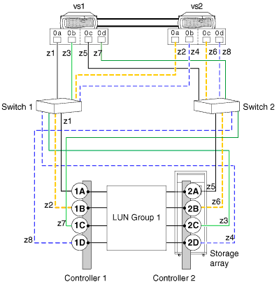

= 8포트 스토리지 LUN 그룹 구성
:allow-uri-read: 
:icons: font
:imagesdir: ../media/

[role="lead"]
8포트 LUN 그룹 구성은 클러스터링된 V-Series 시스템과 어레이 LUN을 사용할 수 있는 ONTAP 시스템에서 지원됩니다.

이 구성은 시스템에서 실행되는 ONTAP 릴리스에 대해 지원되는 상호 운용성 매트릭스에 나열된 모든 스토리지 어레이에서 사용할 수 있도록 지원됩니다.

이 구성을 배포하는 방법에는 교차 접속과 언크로싱 백엔드 접속이라는 두 가지가 있습니다.

== 크로스 백 엔드 연결

백엔드 연결이 교차된 이 구성에서는 동일한 스토리지 어레이 컨트롤러의 FC 연결이 두 패브릭 스위치(중복)로 이동합니다.

교차 백엔드 접속의 그림에서는 노드가 스위치와 스토리지 배열에 어떻게 연결되어 있는지 확인합니다. VS1은 스토리지 배열 컨트롤러 1 포트 1A 및 컨트롤러 2 포트 2C에 연결할 때 스위치 1을 사용하고 스토리지 배열 컨트롤러 2 포트 2A 및 컨트롤러 1 포트 1C에 연결할 때 스위치 2를 사용합니다. 이렇게 하면 스위치 포트와 어레이 포트의 사용이 최적화되므로 스위치 또는 스토리지 어레이 컨트롤러 장애의 영향이 줄어듭니다.

== 백엔드 연결은 교차되지 않습니다

백엔드 연결이 교차되지 않는 이 구성에서는 동일한 스토리지 어레이 컨트롤러의 FC 연결이 하나의 패브릭 스위치로만 연결됩니다.

다음 그림에서는 백엔드 연결이 교차되지 않을 때 이 구성을 보여 줍니다.

image::../media/eight_port_array_lun_group_configuration.gif[8포트 스토리지 LUN 그룹 구성]

* 관련 정보 *

https://mysupport.netapp.com/matrix["NetApp 상호 운용성 매트릭스 툴"]
