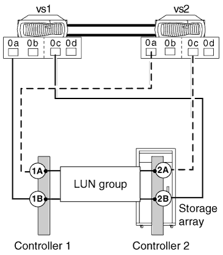
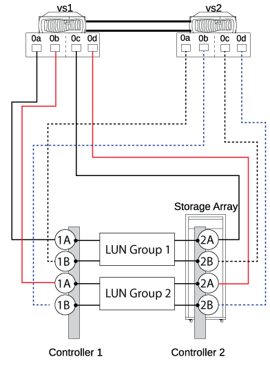

= E-Series 스토리지 어레이에서 지원되는 직접 연결 구성
:allow-uri-read: 
:icons: font
:imagesdir: ../media/

[role="lead"]
ONTAP 시스템을 직접 연결 구성으로 E-Series 스토리지 어레이에 연결할 수 있습니다. 단일 장애 지점이 발생하지 않도록 하려면 ONTAP 시스템과 스토리지 시스템 간의 연결에서 이중화를 확인해야 합니다. FlexArray Stretch MetroCluster는 E-Series 스토리지 어레이를 통해 직접 연결 구성을 지원합니다. 자세한 내용은, https://mysupport.netapp.com/matrix["NetApp 상호 운용성 매트릭스 툴"] 및 https://docs.netapp.com/us-en/ontap-metrocluster/install-stretch/index.html["스트레치 MetroCluster 설치 및 구성"]을 참조하십시오.

상호 운용성 매트릭스에는 ONTAP 시스템의 직접 연결 구성에서 지원되는 E-Series 어레이 모델에 대한 정보가 포함되어 있습니다.

ONTAP은 E-Series 스토리지 어레이에서 다음과 같은 직접 연결 구성을 지원합니다.

== 독립형 기본 구성

독립 실행형 기본 구성에서는 ONTAP 시스템의 FC 이니시에이터 포트 2개가 2포트 어레이 LUN 그룹의 포트에 액세스합니다.

다음 그림에서는 ONTAP FC 이니시에이터 포트 0a 및 0h가 2포트 어레이 LUN 그룹의 타겟 포트에 액세스하는 직접 연결 구성을 보여줍니다.

image::../media/da_2port_standalone.gif[DA 2포트 독립형]

== 4포트 어레이 LUN 그룹입니다

HA 쌍의 각 ONTAP 시스템에 있는 2개의 FC 이니시에이터 포트는 4포트 어레이 LUN 그룹의 서로 다른 스토리지 어레이 포트에 액세스하여 연결 시 이중화를 구현합니다.

다음 그림에서는 ONTAP FC 이니시에이터 포트가 4포트 어레이 LUN 그룹의 타겟 포트에 액세스하는 직접 연결 구성을 보여 줍니다.

또한 HA 페어의 각 ONTAP 시스템에 있는 4개의 FC 이니시에이터 포트를 2개의 서로 다른 4포트 어레이 LUN 그룹에 연결할 수 있습니다. 이렇게 하면 포트 쌍의 각 FC 이니시에이터 포트가 대체 LUN 그룹에 액세스할 수 있습니다.

다음 그림에서는 ONTAP FC 이니시에이터 포트가 4포트 어레이 LUN 그룹 2개의 타겟 포트에 액세스하는 직접 연결 구성을 보여 줍니다.

== 8포트 어레이 LUN 그룹

HA 쌍의 각 ONTAP 시스템에 있는 4개의 FC 이니시에이터 포트는 연결 시 이중화를 위해 8포트 어레이 LUN 그룹의 서로 다른 스토리지 어레이 포트에 액세스합니다.

다음 그림에서는 ONTAP FC 이니시에이터 포트가 8포트 어레이 LUN 그룹의 타겟 포트에 액세스하는 직접 연결 구성을 보여 줍니다.

image::../media/eight_port_direct_attached_ha_pair_configuration.gif[8포트 직접 연결 HA 쌍 구성]
