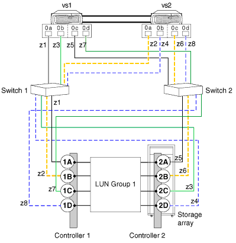

= 유효한 경로: 8포트 스토리지 LUN 그룹 구성
:allow-uri-read: 
:icons: font
:imagesdir: ../media/

[role="lead"]
8포트 LUN 그룹 구성을 사용하면 LUN 그룹당 포트 수가 줄어드는 것보다 경로 이중화와 로드 밸런싱이 필요한 대규모 클러스터 구축 환경에서 스토리지 어레이를 ONTAP 시스템에 연결할 수 있습니다.

이 구성은 교차 또는 언크로싱된 백엔드 연결을 사용하여 설정할 수 있습니다.

== 백엔드 연결이 교차되는 변수입니다

백엔드 연결이 교차된 구성에서는 동일한 스토리지 어레이 컨트롤러의 FC 연결이 두 패브릭 스위치(중복)로 전환됩니다.

이 연결 체계는 백엔드 연결이 교차되지 않는 경우보다 스위치 포트와 스토리지 배열 포트를 더 잘 사용할 수 있으므로 스위치 또는 스토리지 배열 컨트롤러 장애의 영향을 줄입니다.

컨트롤러가 2개뿐인 스토리지 어레이의 경우 교차되지 않은 8포트 스토리지 LUN 그룹 구성보다 8포트 LUN 그룹 구성이 교차됩니다.

각 노드에서 전용 경로(경로당 하나의 FC Initiator-One-Target-Port 조닝)가 있는 경우에만 8포트 어레이 LUN 그룹을 건너뛸 수 있습니다.

교차 백엔드 접속의 그림에서는 ONTAP 시스템이 스위치와 스토리지 어레이에 어떻게 연결되어 있는지 확인합니다. VS1은 스토리지 배열 컨트롤러 1 포트 1A 및 컨트롤러 2 포트 2C에 연결할 때 스위치 1을 사용하고 스토리지 배열 컨트롤러 2 포트 2A 및 컨트롤러 1 포트 1C에 연결할 때 스위치 2를 사용합니다.

다음 표에는 교차 백엔드 연결이 있는 8포트 어레이 LUN 그룹에 대한 조닝이 요약되어 있습니다. 권장되는 조닝 전략은 단일 이니시에이터 조닝입니다.

|===
| Zone(영역) | ONTAP 시스템의 FC 이니시에이터 포트입니다 | 스토리지 시스템 

 a| 
스위치 1

 a| 
z1를 참조하십시오
 a| 
VS1, 포트 0a
 a| 
컨트롤러 1, 포트 1A

 a| 
z2를 참조하십시오
 a| 
VS2, 포트 0a
 a| 
컨트롤러 1, 포트 1B

 a| 
z3를 참조하십시오
 a| 
VS1, 포트 0b
 a| 
컨트롤러 2, 포트 2C

 a| 
z4를 참조하십시오
 a| 
VS2, 포트 0b
 a| 
컨트롤러 2, 포트 2D입니다

 a| 
스위치 2

 a| 
z5를 참조하십시오
 a| 
VS1, 포트 0c
 a| 
컨트롤러 2, 포트 2A

 a| 
z6를 참조하십시오
 a| 
VS2, 포트 0c
 a| 
컨트롤러 2, 포트 2B

 a| 
z7를 참조하십시오
 a| 
VS1, 포트 0d
 a| 
컨트롤러 1, 포트 1C

 a| 
z8를 참조하십시오
 a| 
VS2, 포트 0d
 a| 
컨트롤러 1, 포트 1D

|===

== 백엔드 연결이 _not_crossed인 변수입니다

백엔드 연결이 교차되지 않는 구성에서는 동일한 스토리지 어레이 컨트롤러의 FC 연결이 하나의 패브릭 스위치로만 연결됩니다.

다음 그림에서는 백엔드 접속이 교차되지 않는 8포트 스토리지 LUN 그룹을 사용하는 구성의 경로를 보여 줍니다.

image::../media/eight_port_array_lun_group_configuration.gif[8포트 스토리지 LUN 그룹 구성]

다음 표에는 백엔드 접속이 교차되지 않을 때 8포트 어레이 LUN 그룹에 대한 조닝(Zoning)이 요약되어 있습니다. 권장되는 조닝 전략은 단일 이니시에이터 조닝입니다.

|===
| Zone(영역) | ONTAP 시스템의 FC 이니시에이터 포트입니다 | 스토리지 시스템 

 a| 
스위치 1

 a| 
z1를 참조하십시오
 a| 
VS1, 포트 0a
 a| 
컨트롤러 1, 포트 1A

 a| 
z2를 참조하십시오
 a| 
VS2, 포트 0a
 a| 
컨트롤러 1, 포트 1B

 a| 
z3를 참조하십시오
 a| 
VS1, 포트 0b
 a| 
컨트롤러 1, 포트 1C

 a| 
z4를 참조하십시오
 a| 
VS2, 포트 0b
 a| 
컨트롤러 1, 포트 1D

 a| 
스위치 2

 a| 
z5를 참조하십시오
 a| 
VS1, 포트 0c
 a| 
컨트롤러 2, 포트 2A

 a| 
z6를 참조하십시오
 a| 
VS2, 포트 0c
 a| 
컨트롤러 2, 포트 2B

 a| 
z7를 참조하십시오
 a| 
VS1, 포트 0d
 a| 
컨트롤러 2, 포트 2C

 a| 
z8를 참조하십시오
 a| 
VS2, 포트 0d
 a| 
컨트롤러 2, 포트 2D입니다

|===

== FC 이니시에이터당 최대 어레이 LUN 수에 대한 고려 사항

8포트 어레이 LUN 그룹을 사용하는 구성을 설정할 때는 ONTAP이 FC 이니시에이터 포트당 지원하는 어레이 LUN의 수를 초과할 수 없습니다.
