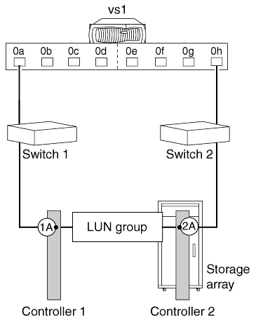

= 유효한 경로 지정: 단일 2포트 스토리지 LUN 그룹이 있는 독립 실행형 시스템입니다
:allow-uri-read: 
:icons: font
:imagesdir: ../media/

[role="lead"]
단일 2포트 어레이 LUN 그룹이 있는 패브릭 연결 독립 실행형 시스템은 대부분의 스토리지 시스템에서 모든 ONTAP 릴리즈를 지원합니다.

[NOTE]
====
동일한 공급업체의 스토리지 시스템에서도 서로 다른 스토리지 어레이가 예에 나와 있는 포트와 다른 레이블을 지정할 수 있습니다. 스토리지 배열에서 선택한 포트가 대체 컨트롤러에 있는지 확인해야 합니다.

====
다음 그림에서는 독립형 ONTAP 시스템이 있는 단일 2포트 어레이 LUN 그룹을 보여 줍니다.

설치를 검증할 때 명령 출력을 아래 예와 비교하여 LUN 그룹 수가 의도한 개수이고 중복 경로가 있는지 확인할 수 있습니다.

.예
다음 예에서는 그림에 나온 구성에 대해 예상되는 출력(각 스토리지 LUN에 대한 중복 경로가 2개인 단일 LUN 그룹(LUN 그룹 0)을 보여 `storage array config show` 줍니다. (그림과 일치하는 출력의 중복 경로는 배열 대상 포트 이름 20** 1A** 00a0b80fee04 및 20** 2A** 00a0b80fee0420에 나와 있습니다.)

[listing]
----

vs1::> storage array config show
             LUN   LUN
Node         Group Count     Array Name    Array Target Port   Initiator
------------ ----- ----- ----------------- ------------------- ----------
vs1           0    50        DGC_RAID5_1	 201A00a0b80fee04     0a
                                             202A00a0b80fee04     0h
----