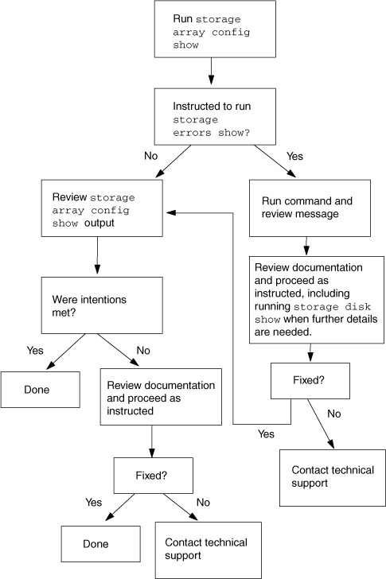

= 스토리지 배열 설치 확인
:allow-uri-read: 
:icons: font
:imagesdir: ../media/

[role="lead"]
운영 환경에 시스템을 배포하기 전에 백엔드 구성 오류를 감지하고 해결하는 것이 중요합니다.

백엔드 구성을 확인하는 두 단계는 다음과 같습니다.

. ONTAP가 스토리지 배열에서 작동하지 못하게 하는 백엔드 구성 오류가 있는지 확인합니다.
+
에 의해 플래그가 지정된 `storage errors show`오류입니다. 이러한 오류를 수정해야 합니다.

. 구성이 의도한 대로 설정되었는지 확인합니다.
+
시스템 관점에서는 오류가 아니지만 의도하지 않은 여러 상황이 있습니다. 예를 `storage array config show` 들어 출력에 두 개의 LUN 그룹이 표시되지만 사용자가 의도한 LUN 그룹은 하나만 표시됩니다. 이 문서는 자신의 의도에 맞지 않는 상황을 지칭합니다.

다음 그림에서는 시스템 관점에서 구성 오류가 없는지 먼저 확인한 다음 설치가 의도한 대로 진행되는지 확인하는 워크플로를 보여 줍니다.

